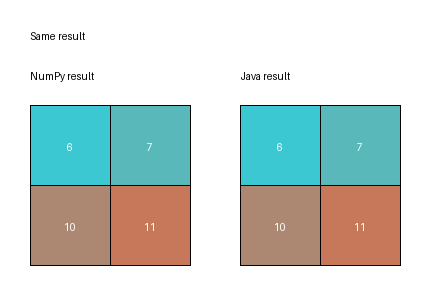

# Task 4: 2D Matrix Slicing

## Goal

The goal of this task is to implement 2D matrix slicing in two ways:

- Python with NumPy matrices
- Java

The matrix size and slice indexes are not hard-coded. The user enters the matrix size, matrix values, row range, and column range. I used the same input for both programs to check that the output is the same.

## Files

```text
task4/code/python/matrix_slice_numpy.py
task4/code/python/visualize_slice_comparison.py
task4/code/java/src/main/java/MatrixSlicer.java
task4/code/java/src/test/java/MatrixSlicerTest.java
task4/code/java/pom.xml
task4/output/slice_comparison.png
```

## Python NumPy Run

Command:

```bash
python3 task4/code/python/matrix_slice_numpy.py
```

Terminal output:

```text
hacizadarufat@anonymous A2 % python3 task4/code/python/matrix_slice_numpy.py
2D matrix slicing in NumPy
Rows of matrix: 4
Columns of matrix: 4
Enter values for the matrix:
Row 1 (4 numbers): 1 2 3 4
Row 2 (4 numbers): 5 6 7 8
Row 3 (4 numbers): 9 10 11 12
Row 4 (4 numbers): 13 14 15 16
Row start index (inclusive): 1
Row end index (exclusive): 3
Column start index (inclusive): 1
Column end index (exclusive): 3
Sliced result:
6 7
10 11
Saved result to /Users/hacizadarufat/Documents/Rufat/ADA/ADAGW/ASP/A2/task4/output/numpy_slice.csv
hacizadarufat@anonymous A2 %
```

In NumPy, the slicing line is simple:

```python
result = matrix[row_start:row_end, col_start:col_end]
```

For this input, rows `1` to `3` and columns `1` to `3` select the middle part of the matrix.

## Java Run and Unit Tests

I used Java for the second implementation. The Java version creates a new matrix and copies the selected values into it.

Test command:

```bash
cd task4/code/java
mvn test
```

Test output:

```text
hacizadarufat@anonymous java % mvn test
[INFO] Running MatrixSlicerTest
[INFO] Tests run: 4, Failures: 0, Errors: 0, Skipped: 0, Time elapsed: 0.025 s -- in MatrixSlicerTest
[INFO] Results:
[INFO] Tests run: 4, Failures: 0, Errors: 0, Skipped: 0
[INFO] BUILD SUCCESS
```

Java run:

```text
hacizadarufat@anonymous java % java -cp target/classes MatrixSlicer
2D matrix slicing in Java
Rows of matrix: 4
Columns of matrix: 4
Enter values for the matrix:
Row 1 (4 numbers): 1 2 3 4
Row 2 (4 numbers): 5 6 7 8
Row 3 (4 numbers): 9 10 11 12
Row 4 (4 numbers): 13 14 15 16
Row start index (inclusive): 1
Row end index (exclusive): 3
Column start index (inclusive): 1
Column end index (exclusive): 3
Sliced result:
6 7
10 11
Saved result to ../../output/java_slice.csv
```

The Java output is the same as the NumPy output:

```text
6 7
10 11
```

## Input Validation

Both programs check the main input problems:

- matrix dimensions must be positive integers
- slice indexes must be inside the matrix range
- start index must be smaller than end index
- each matrix row must contain the expected number of values
- matrix values must be numeric

## Graphical Result

To compare the results visually, both programs save their sliced matrix output as CSV files:

```text
task4/output/numpy_slice.csv
task4/output/java_slice.csv
```

I used CSV because it is simple text and both Python and Java can write it easily. The visualization script reads both CSV files and creates one image.

Command:

```bash
python3 task4/code/python/visualize_slice_comparison.py
```

Output:

```text
hacizadarufat@anonymous A2 % python3 task4/code/python/visualize_slice_comparison.py
Saved comparison image to /Users/hacizadarufat/Documents/Rufat/ADA/ADAGW/ASP/A2/task4/output/slice_comparison.png
```

The generated image shows that both implementations returned the same slice:



## Conclusion

Both implementations slice the same part of the matrix and return the same result. NumPy is shorter because slicing is already built into the library. Java needs more code because the selected values must be copied manually into a new matrix. The graphical output makes it easier to confirm that both solutions match.

## ChatGPT Comparison

After finishing my own implementation, I asked ChatGPT to solve the same task 4.

ChatGPT conversation link: [https://chatgpt.com/share/6ac5340f-c940-83ed-b953-e0c4a2e6f146](https://chatgpt.com/share/6ac5340f-c940-83ed-b953-e0c4a2e6f146)

My prompt asked for NumPy code, Java code, Java unit tests, and README files as finalized outputs. ChatGPT created a full solution package with a Python file, Java file, JUnit test file, README, and graphical comparison images.

ChatGPT's solution used the same basic idea as mine. In Python, it used NumPy slicing. In Java, it created a new matrix and copied the selected values into it. It also added JUnit tests and generated an image to compare the outputs.

The main difference is that ChatGPT used a fixed 5x5 matrix and fixed slice indexes in the code. For example, it sliced rows `1:4` and columns `1:4` from a matrix containing values from `1` to `25`. That produced:

```text
7 8 9
12 13 14
17 18 19
```

This was correct for its example, but it was not fully enough for the assignment because the assignment says that parameters like array size should be provided by user input. In my version, the user enters the matrix size, matrix values, and slice indexes. So the program works for different matrix sizes and different slice ranges, not only one fixed example.

The ChatGPT output helped me compare the general approach, but I changed the final implementation to be more general and closer to the assignment requirements.
